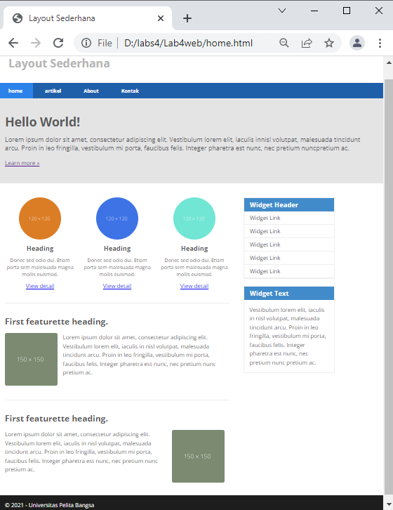
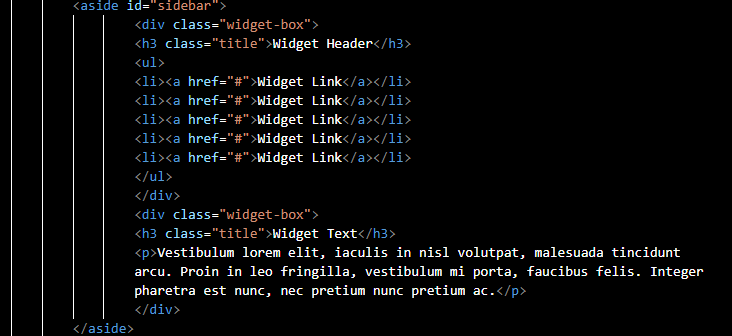

# Lab4Web
## Nama     : Rony Eltom Atibaman
## NIM      : 312010003
## Kelas    : TI.20.D.1
## PRAKTIKUM 4

### Persiapan membuat dokumen HTML dengan nama file lab4_box.html seperti berikut.

### Membuat Box Element
Kemudian tambahkan kode untuk membuat box element dengan tag div seperti berikut. 

### CSS Float Property
Selanjutnya tambahkan deklarasi CSS pada head untuk membuat float element, seperti berikut. 
 
Kemudian buka browser untuk melihat hasilnya. 

### Mengatur Clearfix Element
~<b>Clearfix</b> digunakan untuk mengatur element setelah float element. Property clear digunakan untuk
mengaturnya. 
Tambahkan element div lainnya seteleah div3 seperti berikut. 
 
Kemudian atur property clear pada CSS, seperti berikut. 
 
Selanjutnya buka browser dan refresh kembali. 
 
Lakukan eksperimen terhadap penggunaan property clear dengan nilai lainnya (left, both, right),
dan amati perubahannya.

### Membuat Layout Sederhana
Kita akan membuat layout web sederhana seperti gambar berikut. 
 
Buat <b>folder baru</b> dengan nama <b>lab4_layout</b>, kemudian buatlah file baru didalamnya dengan nama <b>home.html</b>, dan file css dengan nama <b>style.css</b>. 
 
Kemudian tulis kode berikut. 
 
Kemudian buka browser dan lihat hasilnya. 
 
Kemudian tambahkan kode CSS untuk membuat layoutnya. 
 
Kemudian lihat hasilnya pada browser. 

### Membuat Navigasi
Kemudian selanjutnya mengatur navigasi. 
 
Kemudian lihat hasilnya. 

### Membuat Hero Panel.
Selanjutnya membuat hero panel. Tambahkan kode HTML dan CSS seperti berikut. 
 
 

### Mengatur Layout Main dan Sidebar
Selanjutnya mengatur main content dan sidebar, tambahkan CSS float. 

### Membuat Sidebar Widget
Kemudian selanjutnya menambahkan element lain dalam sidebar. 
 
Kemudian tambahkan CSS. 
 

### Mengatur Footer
Selanjutnya mengatur tampilan footer. Tambahkan CSS untuk footer. 
 

### Menambahkan Elemen lainnya pada Main Content
  
Kemudian tambahkan CSS.  

 
Lihat hasilnya dibrowser. 

### Menambahkan Content Artikel
Selanjutnya membuat content artikel. Tambahkan HTML berikut pada main content. 
 
Kemudian tambahkan CSS. 
 
Tampilan browser. 

## Pertanyaan dan Tugas.
1. Tambahkan Layout untuk menu About 
=> buat single layout yang berisi deskripsi, portfolio, dll. 
 >**jawab**
 >> Membuat dokumen HTML dengan nama file <b>about.html</b>. 
  
 > kemudian tambahkan <b>css</b>. 
  
 Berikut tampilan Pada Browser. 
   
2. Tambahkan layout untuk menu Contact 
=> yang berisi form isian: nama, email, message, dll 
>**jawab**
>> Membuat dokumen HTML dengann nama file <b>kontak.html</b> 
 
> Kemudian tambahkan <b>CSS</b>. 

> Berikut Tampilan Pada Browser. 
  
HASIL PEMOGRAMAN WEB SAYA.

**TERIMAKASIH**

